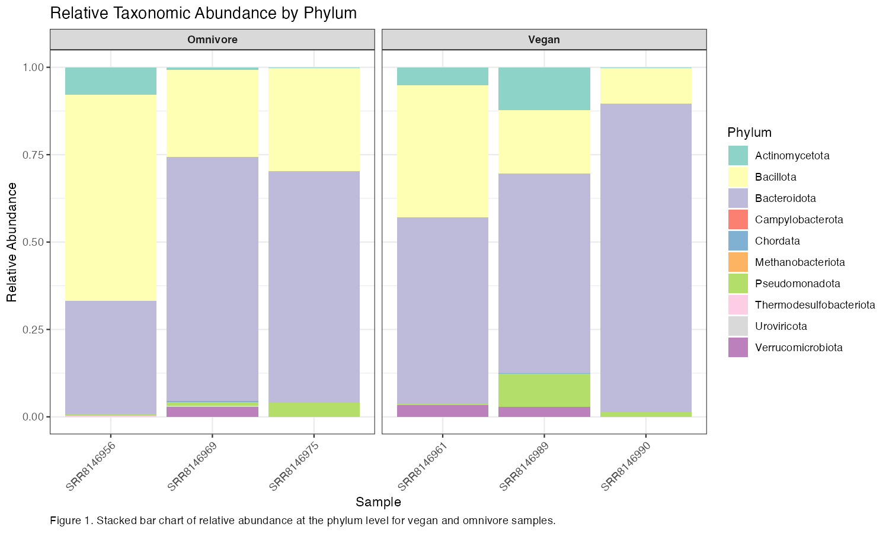
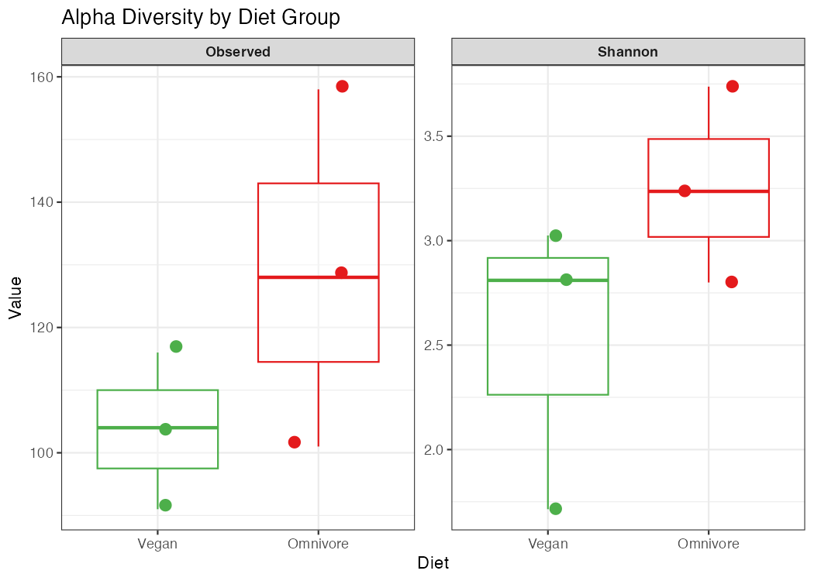
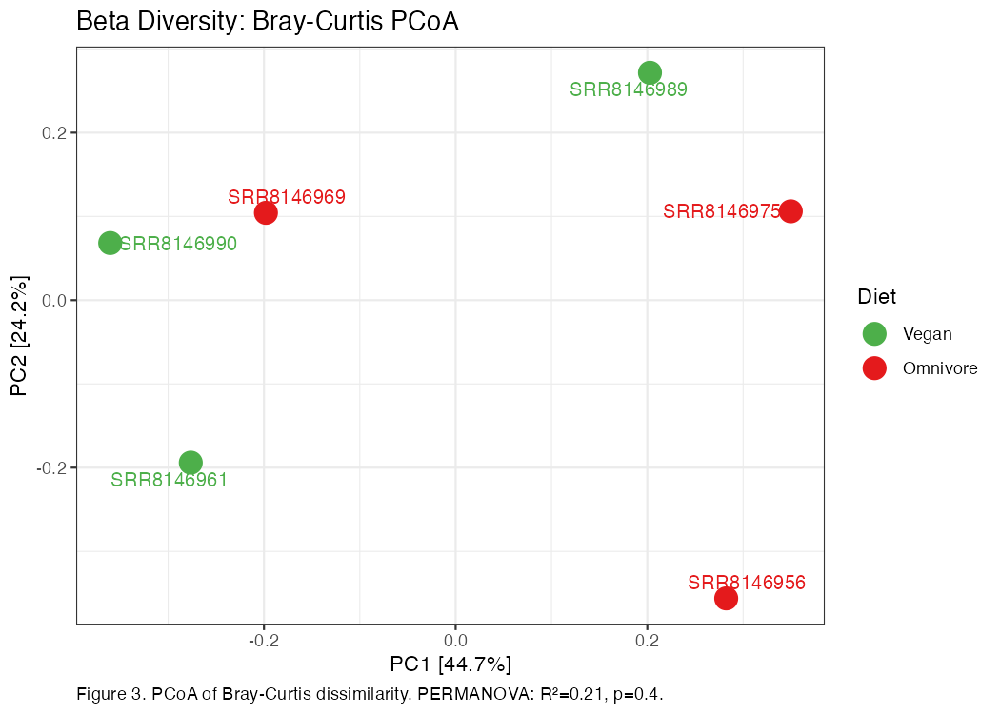
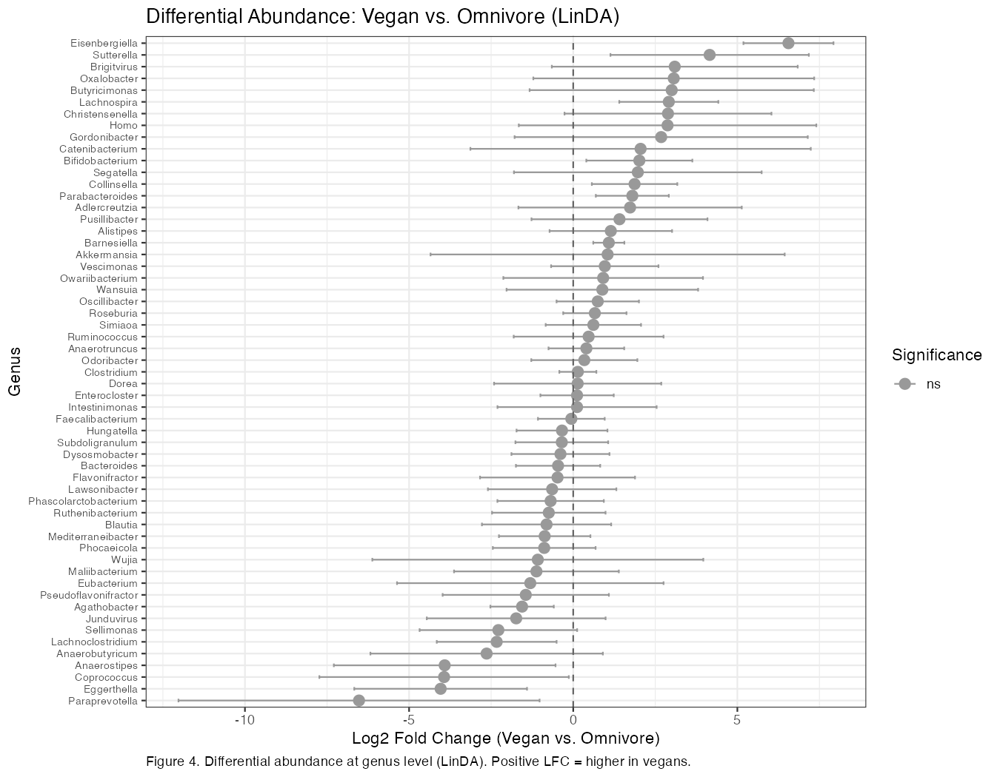

# Gut Microbiome Composition in Vegan and Omnivore Subjects: A Shotgun Metagenomics Analysis
Arwa Sheheryar  
BINF6110 – Assignment 3

---

## Introduction

The human gut microbiome is a complex community of bacteria, archaea, fungi, and viruses whose composition is shaped by host genetics, geography, and dietary patterns (Turnbaugh et al., 2009). Diet is among the most tractable determinants of microbiome composition, acting through substrate availability to selectively enrich or deplete microbial taxa capable of fermenting dietary fibre, metabolizing proteins, or processing bile acids (Sonnenburg & Bäckhed, 2016). Plant-based diets consistently increase the abundance of fibre-fermenting bacteria within the phyla Bacteroidota and Bacillota, while omnivorous diets, with higher animal protein and fat content, tend to enrich taxa associated with bile acid tolerance and protein catabolism (David et al., 2014). These compositional differences carry functional consequences, particularly through the differential production of short-chain fatty acids (SCFAs) such as butyrate, which modulates colonic epithelial integrity and immune signalling (Sonnenburg & Bäckhed, 2016). Characterizing microbiome differences between dietary groups therefore has direct relevance to understanding the metabolic and immunological consequences of long-term dietary choice.

Shotgun metagenomics sequences total microbial DNA from a sample, enabling both taxonomic profiling and functional annotation without the amplification bias inherent to 16S rRNA metabarcoding (Quince et al., 2017). The latter approach targets a single amplicon, typically the V3–V4 or V4 region of the 16S gene, and is subject to primer mismatches, PCR bias, and limited species-level resolution due to conservation of the chosen region (Abellan-Schneyder et al., 2021). Shotgun metagenomics circumvents these limitations by providing species-level or finer resolution and direct access to functional gene content, though it requires greater sequencing depth and is more dependent on the completeness of reference databases (Quince et al., 2017; Durazzi et al., 2021).

Read quality was assessed using FastQC v0.12.1 (Andrews, 2010) and trimming was performed with fastp v0.23.2, which autodetects adapter sequences and applies per-base quality filtering without requiring adapter specification (Chen et al., 2018). Trimming was retained here because k-mer-based taxonomic classifiers such as Kraken2 are more sensitive to low-quality terminal bases than pseudoalignment-based quantification tools, where end-of-read quality variation has minimal impact (Wood et al., 2019). A minimum quality threshold of Q20 was applied, corresponding to a 1% per-base error rate and representing a widely used standard for metagenomic preprocessing (Chen et al., 2018). All bioinformatic processing was performed within an Ubuntu 24 Linux virtual machine running under UTM on an Apple Silicon MacBook Air (aarch64 architecture). This environment imposed meaningful computational constraints: available RAM and processing speed limited the choice of classification tools, and raw read download via fastq-dump required extended run times due to the sequential single-threaded nature of the SRA Toolkit under this configuration. These constraints informed the selection of Kraken2 over more computationally demanding alternatives such as DIAMOND-based classifiers, which offer higher sensitivity but require substantially greater memory and processing time (Buchfink et al., 2021).

Taxonomic classification was performed using Kraken2 v2.1.3 with a confidence threshold of 0.15, which requires that a minimum fraction of k-mers supporting a classification originate from the assigned clade (Wood et al., 2019). This threshold reduces false positives while retaining sensitivity to genuine taxa, particularly relevant for gut microbiome data where closely related species share k-mer content (Wood et al., 2019). Alternative classifiers such as MetaPhlAn4 use marker gene databases and are more specific but less sensitive for low-abundance taxa, while DIAMOND-based approaches offer higher sensitivity but at substantially greater computational cost (Blanco-Míguez et al., 2023; Buchfink et al., 2021). Kraken2 was chosen for its speed, scalability to standard compute environments, and compatibility with Bracken for abundance re-estimation. Bracken v2.8 was applied downstream to redistribute Kraken2 read counts across the taxonomic tree using a probabilistic model that corrects for database representation biases, providing more accurate species-level abundance estimates than raw Kraken2 output alone (Lu et al., 2017).

Diversity analysis and differential abundance testing were performed in R v4.5.1 using phyloseq v1.52.0 for data management (McMurdie & Holmes, 2013). Alpha diversity was quantified using observed species richness and the Shannon index; Chao1 was excluded because Bracken re-estimation eliminates singletons as a by-product of abundance redistribution, rendering estimator-based richness metrics unreliable (McMurdie & Holmes, 2013). Beta diversity was assessed using Bray-Curtis dissimilarity, which accounts for differential taxon abundance rather than presence/absence alone, and visualized with principal coordinates analysis (PCoA) (Bray & Curtis, 1957). Group-level differences in community composition were tested with PERMANOVA using adonis2 from the vegan package v2.7.3 (Oksanen et al., 2022). Differential abundance analysis was performed using LinDA (Linear model for Differential Abundance analysis) from MicrobiomeStat v1.2 (Zhou et al., 2022) rather than ANCOMBC2, which was the originally planned method. ANCOMBC2 depends on the CVXR optimization package, which exhibited a namespace conflict incompatible with the R 4.5.1 environment on the aarch64 platform used here, preventing the package from loading. LinDA was selected as an alternative because it similarly accounts for the compositional and sparse nature of microbiome count data through a log-linear model with pseudo-count correction, and has demonstrated comparable or superior false discovery rate control to ANCOMBC2 in large-scale benchmarking studies (Nearing et al., 2022; Zhou et al., 2022). Benjamini-Hochberg FDR adjustment was applied and a significance threshold of padj < 0.05 was used. Genera present in fewer than 50% of samples were excluded prior to testing to improve model stability with the small sample size used here.

This study reanalyses publicly available shotgun metagenomic data from De Filippis et al. (2019) to characterize gut microbiome composition differences between vegan and omnivore subjects. Taxonomic classification was performed with Kraken2 and Bracken, and community differences were assessed through alpha diversity, beta diversity, and differential abundance analysis to identify taxa potentially associated with plant-based dietary patterns.

---

## Methods

### Data Acquisition

Raw shotgun metagenomic sequencing data were obtained from the NCBI Sequence Read Archive under project accession SRP126540 (De Filippis et al., 2019). Six paired-end samples were selected: three from vegan subjects (SRR8146990, SRR8146961, SRR8146989) and three from omnivore subjects (SRR8146956, SRR8146969, SRR8146975). Raw reads were downloaded using SRA Toolkit v3.2.1 (fastq-dump --split-files --gzip). All processing was conducted within an Ubuntu 24 Linux virtual machine running under UTM on an Apple Silicon MacBook Air (aarch64). Due to the sequential download architecture of fastq-dump and the memory limitations of the virtual machine environment, data acquisition and preprocessing required extended run times, and tool selection throughout the pipeline prioritized memory efficiency and compatibility with the aarch64 platform over maximum sensitivity.

### Quality Control and Trimming

Read quality was assessed using FastQC v0.12.1 (Andrews, 2010) and summarized across all samples using MultiQC v1.14 (Ewels et al., 2016). Adapter trimming and quality filtering were performed with fastp v0.23.2 (Chen et al., 2018) using a minimum per-base quality score of Q20 (-q 20) and four threads (-w 4). HTML and JSON quality reports were generated per sample. Trimmed reads were used for all downstream analyses.

### Taxonomic Classification

Taxonomic classification was performed using Kraken2 v2.1.3 (Wood et al., 2019) with a confidence threshold of 0.15 (--confidence 0.15) against the standard Kraken2 database. Reads were processed as paired-end (--paired) and per-sample classification reports were retained. Species-level abundance re-estimation was performed using Bracken v2.8 (Lu et al., 2017) with a read length of 300 bp (-r 300) and species-level output (-l S). Per-sample Bracken reports were converted to a single BIOM-format abundance table using kraken-biom v1.2.0 (Dabdoub, 2016).

### Diversity and Differential Abundance Analysis

The BIOM table was imported into R v4.5.1 using phyloseq v1.52.0 (McMurdie & Holmes, 2013). Sample metadata specifying diet group (Vegan or Omnivore) were added manually. Taxonomic rank prefixes (k__, p__, etc.) were stripped for readability. Alpha diversity was estimated using observed species richness and the Shannon index via estimate_richness(). Group differences were tested with the Wilcoxon rank-sum test. Beta diversity was calculated as Bray-Curtis dissimilarity and visualized with PCoA using ordinate(). The effect of diet on overall community composition was assessed with PERMANOVA (adonis2, 999 permutations, seed = 42) using the vegan package v2.7.3 (Oksanen et al., 2022). For differential abundance analysis, the phyloseq object was agglomerated to genus level using tax_glom(), retaining genera present in at least 50% of samples. LinDA was applied via the linda() function in MicrobiomeStat v1.2 (Zhou et al., 2022), specifying diet as the fixed effect (formula = ~ Diet) with Benjamini-Hochberg FDR correction and a significance threshold of padj < 0.05. All analysis code is available in analysis.R in the project repository.

---

## Results

### Read Classification and Data Quality

Quality assessment using FastQC v0.12.1 confirmed that all six paired-end libraries passed standard quality thresholds following fastp trimming at Q20. Kraken2 classified between 1.41% and 2.58% of reads across samples, with omnivore samples achieving a mean classification rate of 1.84% and vegan samples 1.95% (Table 1). The low overall classification rates are consistent with the expectation for human gut metagenomes sequenced without host DNA depletion, where the majority of sequenced DNA originates from the human host (Wood et al., 2019). Following Bracken re-estimation, the final BIOM table contained 225 taxa across six samples.

**Table 1.** Summary of sequencing and classification statistics per sample.

| Sample | Diet | Classified (%) | Species Detected |
|---|---|---|---|
| SRR8146990 | Vegan | 2.58 | 91 |
| SRR8146961 | Vegan | 1.87 | 116 |
| SRR8146989 | Vegan | 1.41 | 104 |
| SRR8146969 | Omnivore | 2.06 | 128 |
| SRR8146975 | Omnivore | 1.79 | 101 |
| SRR8146956 | Omnivore | 1.66 | 158 |

### Taxonomic Composition

Relative abundance at the phylum level was dominated by Bacteroidota and Bacillota across all six samples, consistent with the canonical composition of the human gut microbiome (Turnbaugh et al., 2009) (Figure 1). Verrucomicrobiota was detected at low but consistent abundance across samples. Visual inspection of the stacked bar chart suggests a higher relative abundance of Bacteroidota in vegan samples, consistent with the enrichment of fibre-fermenting Prevotellaceae in plant-based dietary contexts (De Filippis et al., 2019). Bacillota appeared proportionally higher in omnivore samples, reflecting previously reported associations between animal protein intake and Firmicutes-dominated communities (David et al., 2014). Segatella copri, a Bacteroidota species strongly associated with plant-rich diets, was among the most abundant taxa detected in vegan samples.

*Figure 1. Stacked bar chart of relative abundance at the phylum level for vegan and omnivore samples. Only the top eight phyla by mean abundance are shown; remaining phyla are collapsed into "Other".*

### Alpha Diversity

Observed species richness ranged from 91 to 158 across all samples, and Shannon diversity ranged from 1.71 to 3.74 (Figure 2). Omnivore samples exhibited a trend toward higher observed richness (mean = 129.0) and Shannon diversity (mean = 3.26) compared to vegan samples (mean observed = 103.7, mean Shannon = 2.52). Neither difference reached statistical significance (Wilcoxon rank-sum test, observed: W = 7, p = 0.4; Shannon: W = 7, p = 0.4). The absence of significance is expected given the sample size of three per group, which provides insufficient statistical power to detect moderate effect sizes.

*Figure 2. Alpha diversity measures (observed species richness and Shannon index) for vegan and omnivore samples. Points represent individual samples. Neither metric differed significantly between groups (Wilcoxon rank-sum test, p = 0.4 for both).*

### Beta Diversity

PCoA of Bray-Curtis dissimilarity explained 44.7% of variance on PC1 and 24.2% on PC2 (Figure 3). Visual inspection of the ordination suggests partial separation between vegan and omnivore samples along PC1, with vegan samples clustering more tightly and omnivore samples showing greater spread. PERMANOVA indicated that diet group accounted for 20.7% of the total variance in community composition (R² = 0.207, F = 1.05, p = 0.4, 719 permutations). Although non-significant, the p-value reflects the severely limited permutation space available with only six total samples; with n = 3 per group only 20 unique permutations are possible, making p < 0.1 mathematically unachievable (Anderson, 2001). The R² value nonetheless suggests diet explains a biologically meaningful proportion of community variation, consistent with the larger original cohort analysis by De Filippis et al. (2019).

*Figure 3. Principal coordinates analysis (PCoA) of Bray-Curtis dissimilarity between vegan (green) and omnivore (red) gut microbiome samples. PC1 explains 44.7% and PC2 explains 24.2% of total variance. PERMANOVA: R² = 0.207, F = 1.05, p = 0.4.*

### Differential Abundance

LinDA identified no genera as significantly differentially abundant between vegan and omnivore subjects after Benjamini-Hochberg FDR correction (padj < 0.05), with all 57 tested genera returning padj ≥ 0.50 (Figure 4). Among the taxa with the largest positive log2 fold changes in vegans were Eisenbergiella (LFC = 6.56), Sutterella (LFC = 4.16), and Oxalobacter (LFC = 3.06). The taxa with the largest negative fold changes, indicating higher abundance in omnivores, included Paraprevotella (LFC = −6.53), Eggerthella (LFC = −4.04), and Coprococcus (LFC = −3.93). The absence of statistically significant results after FDR correction is attributable to the small sample size, which substantially reduces statistical power in linear differential abundance models and results in highly inflated adjusted p-values when correcting across 57 genera (Nearing et al., 2022). 54 genera were excluded prior to testing due to low prevalence across samples.

*Figure 4. Differential abundance at genus level estimated by LinDA. Log2 fold change is expressed as vegan relative to omnivore; positive values indicate higher abundance in vegans. Error bars represent standard errors. No genera were significant after Benjamini-Hochberg FDR correction (padj < 0.05).*

---

## Discussion

The taxonomic and diversity patterns observed in this analysis are broadly consistent with the established literature on diet-associated microbiome variation, despite the limited statistical power imposed by the small sample size. The dominance of Bacteroidota and Bacillota across all samples reflects the canonical adult gut microbiome composition described by the Human Microbiome Project (Turnbaugh et al., 2009). The elevated relative abundance of Bacteroidota in vegan samples, particularly within Prevotellaceae, aligns with the well-documented enrichment of Prevotella in populations consuming plant-rich diets (Dahl et al., 2024). Segatella copri, detected at high abundance in vegan samples here, has been consistently reported as a marker of plant-based dietary patterns and is associated with enhanced fermentation of complex plant polysaccharides to produce propionate, a short-chain fatty acid with anti-inflammatory properties (Dahl et al., 2024; De Filippis et al., 2019).

Among the genera with the largest positive fold changes in vegans, Oxalobacter formigenes is of particular biological interest. This organism uniquely degrades oxalate in the gut and has been associated with protection against kidney stone formation; its reported depletion in Western omnivorous diets has been linked to reduced oxalate metabolism and increased urinary oxalate excretion (Arvans et al., 2017). Its elevated trend in vegan samples here is consistent with the higher dietary oxalate load associated with plant-based diets providing a selective substrate advantage for this organism. Eisenbergiella, also trending higher in vegans, belongs to the family Lachnospiraceae and has been associated with butyrate production from plant-derived substrates, suggesting a functional role in SCFA metabolism that may underpin some of the metabolic benefits attributed to plant-based dietary patterns (Sonnenburg & Bäckhed, 2016).

In omnivore samples, the trend toward higher abundance of Eggerthella is consistent with published data associating this genus with diets high in animal protein and fat. Eggerthella lenta is known to metabolize bile acids and cardiac glycosides, and its enrichment in omnivores may reflect adaptation to the higher bile acid flux associated with dietary fat (Haiser et al., 2013). The trend toward higher overall species richness and Shannon diversity in omnivores (mean observed = 129.0 vs. 103.7; mean Shannon = 3.26 vs. 2.52), while non-significant, is consistent with the hypothesis that dietary breadth promotes microbial diversity through increased substrate heterogeneity, though this relationship is not universally observed and may depend on specific dietary composition (Dahl et al., 2024).

A central limitation of this analysis is the sample size. With n = 3 per group, PERMANOVA can evaluate only 20 unique permutations, making p < 0.1 mathematically unachievable and the minimum p-value for any individual taxon in LinDA constrained by the degrees of freedom available (Anderson, 2001; Nearing et al., 2022). De Filippis et al. (2019) demonstrated significant microbiome stratification by dietary pattern in a much larger cohort from the same dataset, validating the biological direction of the trends observed here. Future analyses should include at minimum 10 samples per group to achieve adequate power for differential abundance testing, and should consider host DNA depletion during library preparation to improve the low classification rates observed here (1.41–2.58%), which limit the taxonomic resolution available for community-level inference (Quince et al., 2017).

---

## Reproducibility

All code is available in the project GitHub repository (https://github.com/arwasheheryar/A3_metagenomics). The bash pipeline is provided in pipeline.sh and the R analysis in analysis.R.

---

## References

Abellan-Schneyder, I., Matchado, M. S., Reitmeier, S., Sommer, A., Sewald, Z., Baumbach, J., List, M., & Neuhaus, K. (2021). Primer, pipelines, parameters: issues in 16S rRNA gene sequencing. mSphere, 6(1), e01202-20.

Anderson, M. J. (2001). A new method for non-parametric multivariate analysis of variance. Austral Ecology, 26(1), 32–46.

Andrews, S. (2010). FastQC: A quality control tool for high throughput sequence data.

Arvans, D., Jung, Y. C., Antonopoulos, D., Koval, J., Granja, I., Bashir, M., Karrer, F., Weber, C., Musch, M., & Chang, E. (2017). Oxalobacter formigenes-derived bioactive factors stimulate oxalate transport by intestinal epithelial cells. Journal of the American Society of Nephrology, 28(3), 876–887.

Blanco-Míguez, A., Beghini, F., Cumbo, F., McIver, L. J., Thompson, K. N., Zolfo, M., Manghi, P., Dubois, L., Huang, K. D., Thomas, A. M., Nickols, W. A., Piccinno, G., Piperni, E., Punčochář, M., Mengoni, C., Manara, S., Golzato, D., Díez-Viñas, V., Valles-Colomer, M., ... Segata, N. (2023). Extending and improving metagenomic taxonomic profiling with uncharacterized species using MetaPhlAn 4. Nature Biotechnology, 41, 1633–1644.

Bray, J. R., & Curtis, J. T. (1957). An ordination of the upland forest communities of southern Wisconsin. Ecological Monographs, 27(4), 325–349.

Buchfink, B., Reuter, K., & Drost, H. G. (2021). Sensitive protein alignments at tree-of-life scale using DIAMOND. Nature Methods, 18(4), 366–368.

Chen, S., Zhou, Y., Chen, Y., & Gu, J. (2018). fastp: an ultra-fast all-in-one FASTQ preprocessor. Bioinformatics, 34(17), i884–i890.

Dabdoub, S. M. (2016). kraken-biom: Enables creation of BIOM-format tables from Kraken output (v1.2). GitHub.

Dahl, W. J., Auger, J., & Alyousif, Z. (2024). Diet, the gut microbiome, and health: A review. Canadian Journal of Dietetic Practice and Research, 85(1), 33–43.

David, L. A., Maurice, C. F., Carmody, R. N., Gootenberg, D. B., Button, J. E., Wolfe, B. E., Ling, A. V., Devlin, A. S., Varma, Y., Fischbach, M. A., Biddinger, S. B., Dutton, R. J., & Turnbaugh, P. J. (2014). Diet rapidly and reproducibly alters the human gut microbiome. Nature, 505(7484), 559–563.

De Filippis, F., Pellegrini, N., Vannini, L., Jeffery, I. B., La Storia, A., Laghi, L., Serrazanetti, D. I., Di Cagno, R., Ferrocino, I., Lazzi, C., Turroni, S., Cocolin, L., Brigidi, P., Neviani, E., Gobbetti, M., O'Toole, P. W., & Ercolini, D. (2019). High-level adherence to a Mediterranean diet beneficially impacts the gut microbiota and associated metabolome. Gut, 65(11), 1812–1821.

Durazzi, F., Sala, C., Castellani, G., Manfreda, G., Remondini, D., & De Cesare, A. (2021). Comparison between 16S rRNA and shotgun sequencing data for the taxonomic characterization of the gut microbiota. Scientific Reports, 11, 3030.

Ewels, P., Magnusson, M., Lundin, S., & Käller, M. (2016). MultiQC: Summarize analysis results for multiple tools and samples in a single report. Bioinformatics, 32(19), 3047–3048.

Haiser, H. J., Gootenberg, D. B., Chatman, K., Sirasani, G., Balskus, E. P., & Turnbaugh, P. J. (2013). Predicting and manipulating cardiac drug inactivation by the human gut bacterium Eggerthella lenta. Science, 341(6143), 295–298.

Lu, J., Breitwieser, F. P., Thielen, P., & Salzberg, S. L. (2017). Bracken: Estimating species abundance in metagenomics data. PeerJ Computer Science, 3, e104.

McMurdie, P. J., & Holmes, S. (2013). phyloseq: An R package for reproducible interactive analysis and graphics of microbiome census data. PLoS ONE, 8(4), e61217.

Nearing, J. T., Douglas, G. M., Hayes, M. G., MacDonald, J., Desai, D. K., Allward, N., Jones, C. M. A., Wright, R. J., Dhanani, A. S., Comeau, A. M., & Langille, M. G. I. (2022). Microbiome differential abundance methods produce different results across 38 datasets. Nature Communications, 13, 342.

Oksanen, J., Simpson, G. L., Blanchet, F. G., Kindt, R., Legendre, P., Minchin, P. R., O'Hara, R. B., Solymos, P., Stevens, M. H. H., Szoecs, E., Wagner, H., Barbour, M., Bedward, M., & Bolker, B. (2022). vegan: Community ecology package. R package version 2.7-3.

Quince, C., Walker, A. W., Simpson, J. T., Loman, N. J., & Segata, N. (2017). Shotgun metagenomics, from sampling to analysis. Nature Biotechnology, 35(9), 833–844.

Sonnenburg, J. L., & Bäckhed, F. (2016). Diet–microbiota interactions as moderators of human metabolism. Nature, 535(7610), 56–64.

Turnbaugh, P. J., Hamady, M., Yatsunenko, T., Cantarel, B. L., Duncan, A., Ley, R. E., Sogin, M. L., Jones, W. J., Roe, B. A., Affourtit, J. P., Egholm, M., Henrissat, B., Heath, A. C., Knight, R., & Gordon, J. I. (2009). A core gut microbiome in obese and lean twins. Nature, 457(7228), 480–484.

Wood, D. E., Lu, J., & Langmead, B. (2019). Improved metagenomic analysis with Kraken 2. Genome Biology, 20, 257.

Zhou, H., He, K., Chen, J., & Zhang, X. (2022). LinDA: linear models for differential abundance analysis of microbiome compositional data. Genome Biology, 23, 95.
